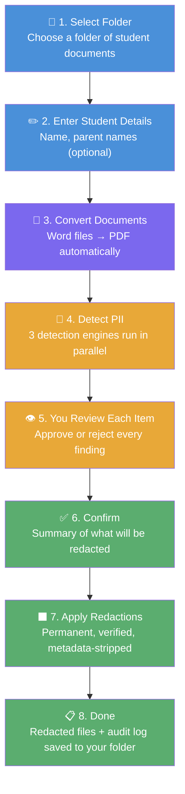
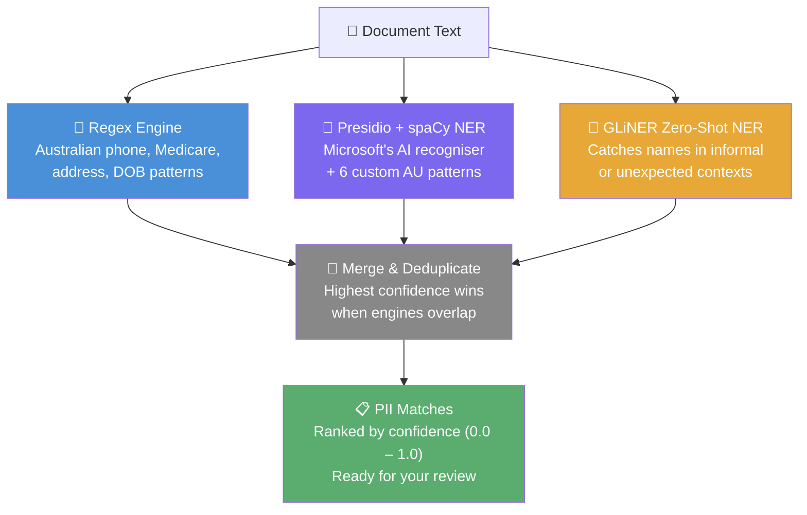
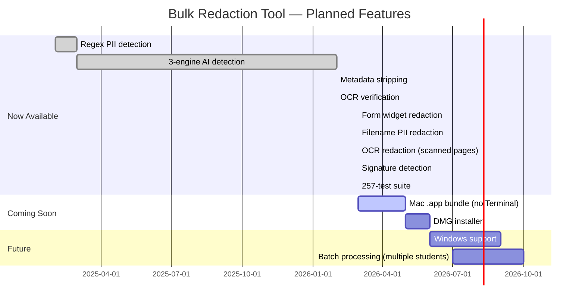

# 🖊️ Bulk Redaction Tool

**A free, private, Mac-based tool for removing student personal information from assessment documents — before you share them with anyone.**

Built for Australian teachers, psychologists, and support staff who handle sensitive student records. Everything runs on your own Mac. No accounts. No subscriptions. No data ever leaves your computer.

---

## 📥 Downloads

> **Coming soon.** A one-click Mac installer (`.dmg`) is in development — no Terminal, no setup required.
>
> In the meantime, follow the [Installation Guide](#-installation-guide) below to get started.
>
> **Star or watch this repository** on GitLab to be notified when the download is available:
> 👉 [gitlab.com/davearmswork/bulk-redaction-tool](https://gitlab.com/davearmswork/bulk-redaction-tool)

---

## 🧭 What Is This?

When sharing student assessment reports — with other schools, services, or agencies — Australian privacy law and professional ethics require that identifying information be removed. Doing this manually is slow, error-prone, and stressful.

**The Bulk Redaction Tool automates this process.** You point it at a folder of documents, tell it the student's name, and it:

1. Finds every piece of personally identifiable information (PII) in the documents
2. Shows you each item for approval — you stay in control
3. Burns the approved items out of the PDFs permanently (not just visually covered — the text is gone)
4. Saves redacted copies alongside the originals, which are never touched
5. Produces a full audit log of everything that was redacted

> **Plain English:** It's like using a black marker on paper, except it works on PDFs and Word documents, it finds things you might miss, and it can't be undone by selecting the text.

---

## 🔒 Privacy & Safety Guarantees

This matters most for a tool handling children's data.

| Guarantee | Detail |
|-----------|--------|
| ✅ **Original files never modified** | Redacted copies are saved separately. Your source documents are untouched. |
| ✅ **Text is permanently destroyed** | Redacted text cannot be recovered via copy/paste, search, or any PDF tool. It is not hidden — it is gone. |
| ✅ **Metadata is stripped** | Author names, dates, and hidden document properties (XMP data) are removed from output PDFs. |
| ✅ **100% local processing** | No internet connection required. Your documents never leave your Mac. |
| ✅ **No accounts or cloud services** | Nothing is uploaded anywhere. Ever. |
| ✅ **Scanned pages handled** | Image-only pages (scans) are redacted via OCR + image rewriting. No page is left behind. |
| ✅ **Redaction verified** | After redaction, the tool re-scans the output at 300 DPI to confirm the text is visually gone. |
| ✅ **Form fields cleaned** | Interactive PDF form fields (AcroForm widgets) containing PII are deleted — not just hidden. |
| ✅ **Signatures detected** | Handwritten signature images are automatically identified and blacked out using heuristic analysis. |
| ✅ **Full audit trail** | A `redaction_log.txt` records every item redacted, with page numbers and confidence levels. |

---

## 🔍 How It Works

### The Workflow



### How PII Is Detected

The tool uses **three detection engines simultaneously**, then merges and deduplicates the results. This multi-engine approach catches far more than any single method:



**Why three engines?**
- **Regex** is fast and precise for structured data (phone numbers, Medicare numbers)
- **Presidio + spaCy** uses machine learning to recognise names and locations even when they appear in unexpected formats
- **GLiNER** is a zero-shot model — it can identify names it has never seen before, catching informal mentions that structured patterns miss

---

## 🛡️ What Gets Detected

All detection is tuned for **Australian** documents and naming conventions.

| Category | Examples | Engine |
|----------|----------|--------|
| Student name (all variations) | Full name, first name, last name, initials | Regex + Presidio + GLiNER |
| Parent / guardian names | Names provided by you, or found near keywords like "Mother:", "Father:" | Regex + GLiNER |
| Family member names | Siblings, carers, emergency contacts | Regex + GLiNER |
| Phone numbers | Mobile (04xx), landline, +61 format | Regex + Presidio |
| Email addresses | Any format | Regex |
| Home address | Street, suburb, state, postcode | Regex + Presidio |
| Date of birth | Only when labelled (DOB:, Date of Birth:, etc.) | Regex |
| Medicare number | 10-digit format, only when "Medicare" appears nearby | Regex + Presidio |
| Centrelink CRN | 9-character reference, only when labelled | Regex |
| Student ID | 3-letter prefix + 3 or more digits | Regex |
| Person names (unlabelled) | AI-detected names in free text | Presidio + GLiNER |
| Location mentions | Suburb and location references | Presidio |

### Name Detection — In Depth

The tool doesn't just search for the exact name you typed. It automatically generates **variations** of the student name and checks for all of them:

| Input | Variations Generated |
|-------|---------------------|
| `Joe Bloggs` | "Joe Bloggs", "Joe", "Bloggs", "J Bloggs", "J. Bloggs", "JF", "J.F." |

It also handles:

- **Possessive forms**: "Joe's" and "Joe's" (curly apostrophes) are matched as "Joe"
- **Contextual family detection**: If a line contains "(mother)" or "(father)", nearby names are flagged even without explicit labels
- **Parenthetical name patterns**: "Joe (parent: Sarah Bloggs)" catches both the student and parent name
- **Short names preserved**: Even 2-character names like "Jo" are matched if they exactly match the student name you entered

### Filename Redaction

If the student's name appears in the **filename** of a document (e.g. `Joe_Bloggs_Assessment.pdf`), the output file's name will have the PII replaced with `[REDACTED]`:

```
Input:  Joe_Bloggs_Assessment.pdf
Output: [REDACTED]_[REDACTED]_Assessment_redacted.pdf
```

This prevents accidental disclosure through file names in shared folders or email attachments.

---

## ⬛ How Redaction Works

The tool uses **three different redaction strategies** depending on the type of content in each PDF page. This happens automatically — you don't need to choose.

### Strategy 1 — Text Layer Redaction (standard PDFs)

Most PDFs have a searchable text layer. For these pages:

1. The tool searches the text layer for each approved PII item
2. It draws a redaction annotation over the matching text
3. It applies the redaction — **permanently destroying the underlying text**
4. The redacted area becomes a solid black rectangle

This uses PyMuPDF's `apply_redactions()` with `images=PDF_REDACT_IMAGE_NONE` — meaning images on text-layer pages are never touched, only the text.

### Strategy 2 — OCR Image Redaction (scanned pages)

Scanned documents (where each page is a photograph or scan) have **no text layer** — the words exist only as pixels in an image. For these pages:

1. The page is rendered at **300 DPI** to a high-resolution image
2. **Tesseract OCR** reads every word and its position on the page
3. Each OCR word is compared against the approved PII list using intelligent matching:
   - Punctuation-stripped comparison (handles "Joe," matching "Joe")
   - Possessive handling ("Joe's" matches "Joe")
   - Special character preservation for emails/URLs ("joe@email.com" matched as-is)
4. Matching words are blacked out by drawing filled rectangles on the image
5. The original page content is replaced with the redacted image

> **Plain English:** The tool photographs the scanned page, reads the text in the photo using OCR, blacks out the PII words on the photo, then replaces the original page with the blacked-out version.

### Strategy 3 — Form Widget Deletion (interactive PDFs)

Some PDFs contain interactive form fields (text boxes, dropdowns) — called AcroForm widgets. These can contain PII that is invisible to text-layer search. For example, a student's name might be typed into a fillable "Name:" field.

After text-layer and OCR redaction, the tool:

1. Scans every form widget (annotation) on each page
2. Reads the widget's field value
3. If the value matches any redacted PII text, the **entire widget is deleted**

This is important because form fields store data separately from the text layer — you can't redact them with black boxes alone.

### Strategy 4 — Signature Detection (heuristic image analysis)

Handwritten signatures embedded as images in PDFs are automatically detected and blacked out. The tool examines every embedded image on every page using four heuristic gates:

1. **Aspect ratio** — signatures are wide and short (width ÷ height > 2.0)
2. **Position** — signatures don't span the full page width (bounding box < 250 points wide on the page)
3. **Pixel size** — the image must be large enough to be a real signature (> 50 px wide, < 200 px tall)
4. **Ink ratio** — signatures have thin pen strokes on a white background (< 30% dark pixels)

Images that pass all four gates are replaced with solid black rectangles of the same size. This runs on **every page**, not just pages with other detected PII — because signatures often appear on pages with no other personal information.

> **Plain English:** The tool looks at every picture embedded in the PDF. If a picture is wide, flat, small, and mostly white with thin dark lines — it's probably a signature, and it gets blacked out.

### Which Strategy Is Used When?

The tool checks **each page independently**:

| Page Type | Detection Method | Redaction Method |
|-----------|-----------------|------------------|
| Has text layer | `page.get_text("words")` returns words | Text-layer redaction (Strategy 1) |
| Image-only (scan) | No text, but images present | OCR image redaction (Strategy 2) |
| Has form widgets | `page.widgets()` returns annotations | Widget deletion (Strategy 3, runs after 1 or 2) |
| Has embedded images | `page.get_images()` returns image refs | Signature detection (Strategy 4, runs on all pages) |

A single PDF can have mixed pages — some with text, some scanned. Each page gets the right strategy automatically. Strategy 4 runs on every page regardless of type.

### What Is NOT Redacted

- Professional names (psychologists, teachers, doctors — unless they match the student name)
- School names and organisations
- Assessment dates (unless explicitly labelled as a date of birth)
- Technical language, scores, and diagnostic terms
- Non-signature images (logos, charts, photos that don't match the signature heuristic)

### Confidence Scores

Every detected item is scored from **0.0** (uncertain) to **1.0** (certain). You see this score when reviewing — it helps you decide whether to approve or skip borderline items. You always have the final say.

---

## 💻 System Requirements

| Requirement | Details |
|-------------|---------|
| **Operating system** | macOS (Apple Silicon M1/M2/M3 or Intel) |
| **Python** | Version 3.13 or later |
| **LibreOffice** | Required for Word → PDF conversion |
| **Tesseract OCR** | Required for scanned/image-only PDFs |
| **Disk space** | ~2 GB (for AI models: spaCy + GLiNER) |
| **RAM** | 8 GB recommended |
| **Internet** | Only needed during installation |

> **Windows and Linux** are not currently supported. They are on the roadmap.

---

## 🚀 Installation Guide

> 💡 **This guide assumes no prior experience** with Terminal or coding. Take it one step at a time. If anything goes wrong, see [Troubleshooting](#-troubleshooting).

### Step 1 — Open Terminal

Terminal is a built-in Mac app that lets you type instructions to your computer.

1. Press **⌘ Command + Space** to open Spotlight Search
2. Type `Terminal` and press **Enter**
3. A window with a text prompt will appear — this is normal

---

### Step 2 — Install Homebrew (Mac package manager)

Homebrew is a free tool that makes installing other software easy. If you've already done this before, skip to Step 3.

Paste this into Terminal and press **Enter**:

```bash
/bin/bash -c "$(curl -fsSL https://raw.githubusercontent.com/Homebrew/install/HEAD/install.sh)"
```

Follow the on-screen instructions. It may ask for your Mac password (you won't see it as you type — that's normal).

---

### Step 3 — Install LibreOffice

LibreOffice converts Word documents to PDF for processing.

```bash
brew install --cask libreoffice
```

---

### Step 4 — Install Tesseract OCR

Tesseract reads text from scanned documents and images.

```bash
brew install tesseract
```

---

### Step 5 — Install Python 3.13

```bash
brew install python@3.13
```

---

### Step 6 — Download the Redaction Tool

If you have `git` installed:

```bash
git clone https://gitlab.com/davearmswork/bulk-redaction-tool.git
cd bulk-redaction-tool
```

Or download the ZIP file from GitLab:
1. Go to [gitlab.com/davearmswork/bulk-redaction-tool](https://gitlab.com/davearmswork/bulk-redaction-tool)
2. Click the blue **Code** button → **Download source code** → **zip**
3. Unzip the downloaded file
4. In Terminal, navigate to the folder: `cd ~/Downloads/bulk-redaction-tool`

---

### Step 7 — Set Up the Python Environment

This creates a private workspace for the tool's Python code (so it doesn't interfere with anything else on your Mac):

```bash
python3.13 -m venv venv
source venv/bin/activate
pip install -r requirements.txt
```

This step downloads the AI models and may take **5–10 minutes**. You'll see a progress bar. That's normal.

---

### Step 8 — Download the spaCy Language Model

```bash
python -m spacy download en_core_web_lg
```

---

### ✅ Installation Complete

You're ready to run the tool. You won't need to repeat these steps — just start from [Running the App](#-running-the-app) next time.

---

## 🎬 Running the App

### Every time you want to use the tool:

1. Open Terminal
2. Navigate to the tool's folder (replace the path with wherever you saved it):

```bash
cd ~/bulk-redaction-tool
```

3. Run the app:

```bash
./run.sh
```

4. Your browser will open automatically to `http://localhost:8501`

If the browser doesn't open, manually visit: **http://localhost:8501**

### To stop the app:

Press **Control + C** in Terminal.

---

## 📖 Using the App — Screen by Screen

### Screen 1 — Select Folder & Enter Student Details

```
┌─────────────────────────────────────────────────┐
│  📂 Folder path: [/path/to/student/documents   ]│
│                                                  │
│  👤 Student name: [                            ] │
│  👨‍👩‍👧 Parent name (optional): [                 ] │
│  👪 Other family names (optional): [           ] │
│                                                  │
│              [ Start Processing → ]              │
└─────────────────────────────────────────────────┘
```

- **Folder path**: Paste or type the full path to a folder containing the student's documents (PDFs and/or Word files). The folder can contain multiple documents.
- **Student name**: First and last name. The tool automatically generates variations (first name only, last name only, initials, etc.)
- **Parent/Guardian name**: Optional. Helps catch parent names that appear in documents.
- **Other family names**: Optional. Siblings, carers, emergency contacts.

> 💡 **Tip:** To find a folder's path on Mac, right-click the folder in Finder, hold **Option**, and select **Copy "folder" as Pathname**.

---

### Screen 2 — Document Conversion

The tool shows which documents were found and whether Word files were successfully converted to PDF. Green = ready. Orange = needs attention (the original Word file is still processed where possible).

---

### Screen 3 — Review Detected PII

This is the most important screen. **You review every item the tool found** — nothing is redacted without your approval.

```
┌─────────────────────────────────────────────────┐
│  Document: Assessment_Report.pdf     Page 2     │
│  ─────────────────────────────────────────────  │
│  ✅  "Joe Bloggs"        Student name    1.00    │
│  ✅  "04 1234 5678"     Phone number    0.98    │
│  ✅  "joe@email.com"   Email address   0.97    │
│  ⬜  "John"             Person (NER)    0.62    │
│  ⬜  "Melbourne"        Location (NER)  0.55    │
│  ─────────────────────────────────────────────  │
│  [ ← Previous ]              [ Next → Continue ]│
└─────────────────────────────────────────────────┘
```

- **Tick the checkbox** next to items you want redacted
- **Leave items unticked** if they should stay (e.g. a teacher's name, a school name)
- **Confidence score** (0.0 – 1.0): Higher = more certain. Items below 0.7 are worth double-checking.

---

### Screen 4 — Confirm

A summary of how many items across how many documents will be redacted. Review it, then click **Create Redacted Documents**.

---

### Screen 5 — Complete

- **Green banner**: Redaction succeeded and was verified
- **Orange banner**: Some pages were image-only (scanned) and were redacted via OCR — review recommended, as OCR quality depends on scan quality
- **Red banner**: A verification check failed — review that document carefully

Links to open the output folder and view the audit log are on this screen.

---

## 📁 Output Files

After processing, two items are added to your original folder:

```
your-folder/
├── original-document.pdf          ← never modified
├── original-document.docx         ← never modified
├── redacted/
│   ├── original-document_redacted.pdf    ← redacted copy
│   └── another-doc_redacted.pdf
└── redaction_log.txt              ← full audit trail
```

### The Audit Log

`redaction_log.txt` records every redaction:

```
Document: Assessment_Report.pdf
  Page 2, Line 4  │ "Joe Bloggs"     │ Student name  │ confidence: 1.00
  Page 2, Line 7  │ "04 1234 5678"  │ Phone number  │ confidence: 0.98
  Page 3, Line 1  │ "joe@mail.com" │ Email address │ confidence: 0.97

ℹ️  NOTE: Scanned_Report.pdf
  Pages 1-3 used OCR redaction (image-only pages) — review recommended
```

Keep this log. It is your record of what was removed and when.

---

## 🔧 Troubleshooting

### "LibreOffice not found"

```bash
brew install --cask libreoffice
```

### "Tesseract not found"

```bash
brew install tesseract
```

### "No module named presidio_analyzer" or similar

Your virtual environment may not be active. Run:

```bash
source venv/bin/activate
pip install -r requirements.txt
```

### "Port already in use"

Streamlit will automatically try the next available port (8502, 8503, etc.). Check the Terminal output for the correct URL.

### Browser doesn't open

Manually navigate to: **http://localhost:8501**

### Word documents not converting

Make sure LibreOffice is installed (Step 3 above). On Intel Macs, the tool also checks `/usr/local/bin/soffice` (Homebrew) and the app bundle automatically.

### Scanned documents not being read

Make sure Tesseract is installed (Step 4 above). Documents that are scans of printed pages (image-only PDFs) are read via OCR — the quality of detection depends on the scan quality.

### A redaction didn't work on a scanned page

Scanned pages are redacted using OCR (optical character recognition). The quality of redaction depends on the scan quality — blurry or low-resolution scans may cause Tesseract to misread words. If you see PII surviving redaction on a scanned page:

1. Check the scan quality — re-scan at 300 DPI or higher if possible
2. The audit log will note which pages used OCR redaction
3. For very poor scans, manual redaction may still be needed

### "OCR redaction used" warning in the audit log

This is informational, not an error. It means the tool detected image-only pages and used the OCR redaction path (Strategy 2 above). The redaction still happened — the warning is there so you know to double-check those pages, since OCR is less precise than text-layer redaction.

---

## 🗺️ Roadmap



---

## 🏗️ For Developers

### Repository

```
https://gitlab.com/davearmswork/bulk-redaction-tool
```

Branches: `main` (stable) · `test` (development)

### File Structure

```
bulk-redaction-tool/
├── app.py                          # Streamlit entry point
├── run.sh                          # Launch script
├── requirements.txt                # Python dependencies
├── venv/                           # Virtual environment (not in git)
│
├── src/
│   ├── core/
│   │   ├── pii_orchestrator.py     # 3-engine orchestrator (main detection entry point)
│   │   ├── pii_detector.py         # Regex detection engine + PIIMatch dataclass
│   │   ├── presidio_recognizers.py # 6 custom Australian Presidio recognizers
│   │   ├── gliner_provider.py      # GLiNER zero-shot NER wrapper
│   │   ├── redactor.py             # Multi-path redaction (text-layer + OCR + signature) + metadata strip
│   │   ├── text_extractor.py       # Text + OCR extraction from PDFs
│   │   ├── document_converter.py   # LibreOffice Word → PDF conversion
│   │   ├── binary_resolver.py      # Cross-platform binary path resolution (Tesseract, LibreOffice)
│   │   ├── logger.py               # Audit log generation and save
│   │   └── session_state.py        # Streamlit session management + navigate_to()
│   ├── services/
│   │   ├── conversion_service.py   # Document conversion business logic
│   │   ├── detection_service.py    # PII detection business logic
│   │   └── redaction_service.py    # Redaction orchestration (routes text-layer vs OCR pages)
│   └── ui/
│       └── screens.py              # All 5 Streamlit screens
│
├── backend/
│   ├── main.py                     # FastAPI API layer (Phase 2 desktop app)
│   └── schemas.py                  # Pydantic request/response models
│
├── desktop/                        # Vite + React + Electron frontend (Phase 2)
│   ├── electron/
│   │   ├── main.cjs                # Electron main process
│   │   └── preload.cjs             # Electron preload script
│   └── src/
│       ├── pages/                  # 5 wizard pages
│       └── components/             # Layout, Sidebar
│
└── tests/
    ├── test_pii_detector.py         # 39 tests: phone, email, address, Medicare, CRN, Student ID, DOB
    ├── test_pii_detector_names.py   # 54 tests: name variations, contextual, possessives, family
    ├── test_pii_orchestrator.py     # 22 tests: orchestrator merge, dedup, multi-engine
    ├── test_presidio_recognizers.py # 18 tests: 6 AU recognizer unit tests
    ├── test_gliner_provider.py      # 12 tests: GLiNER wrapper tests
    ├── test_redactor.py             # 11 tests: text-layer redaction, metadata, routing, possessive matching
    ├── test_signature_detection.py  # 16 tests: signature heuristic gates, image replacement
    ├── test_ocr_redaction.py        # 19 tests: OCR page detection, image redaction, word matching
    ├── test_ocr_verification.py     # 7 tests: post-redaction OCR verification
    ├── test_metadata_stripping.py   # 8 tests: PDF metadata removal
    ├── test_widget_redaction.py     # 6 tests: AcroForm widget deletion
    ├── test_filename_redaction.py   # 13 tests: PII in filenames
    └── test_binary_resolver.py      # 6 tests: cross-platform binary path resolution
```

### Running Tests

```bash
source venv/bin/activate
pytest tests/ -v
```

All 257 tests should pass in under 5 minutes.

### Tech Stack

| Component | Technology |
|-----------|-----------|
| UI (Streamlit version) | Streamlit |
| UI (Desktop version) | Electron + React + Vite + Tailwind v4 |
| API layer (Desktop) | FastAPI |
| PDF processing | PyMuPDF (fitz) |
| Image redaction | Pillow (PIL) ImageDraw |
| AI / NER | Microsoft Presidio + spaCy `en_core_web_lg` |
| Zero-shot NER | GLiNER |
| OCR | Tesseract + pytesseract |
| Word conversion | LibreOffice headless |
| State management (Desktop) | Zustand |
| Tests | pytest (257 tests) |
| Language | Python 3.13+ |

---

## 🤝 Contributing

This tool is actively developed. Bug reports and suggestions are welcome — please open an issue on GitLab.

If you are a teacher, school psychologist, or support staff and would like to share feedback about what the tool does or doesn't catch in real documents (without sharing the documents themselves), please open an issue with the label `feedback`.

---

## 📄 Licence

This project is currently unlicensed (private development). A licence will be added when the public release is made. Until then, please do not redistribute.

---

*Built with ❤️ for Australian educators handling sensitive student data.*
*All processing is local. Your students' information stays on your Mac.*
