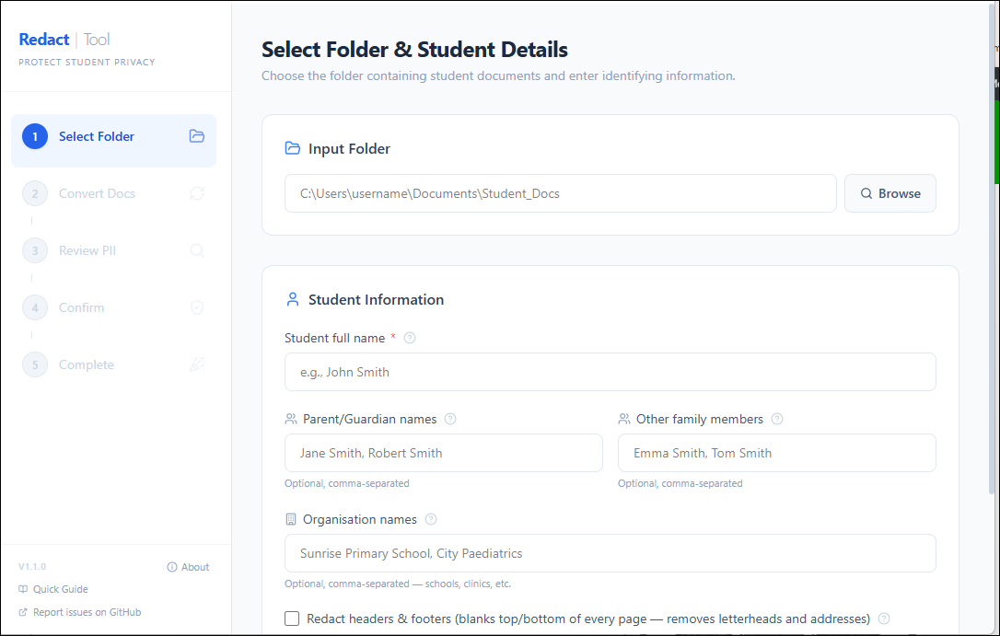
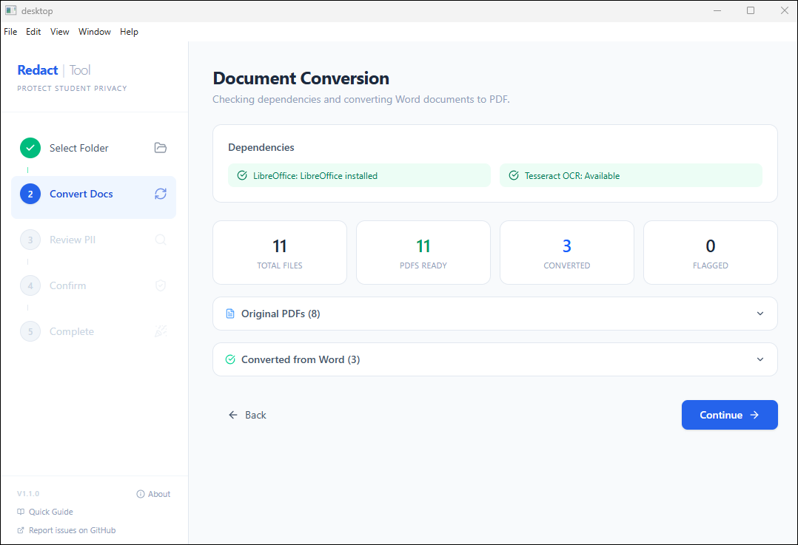
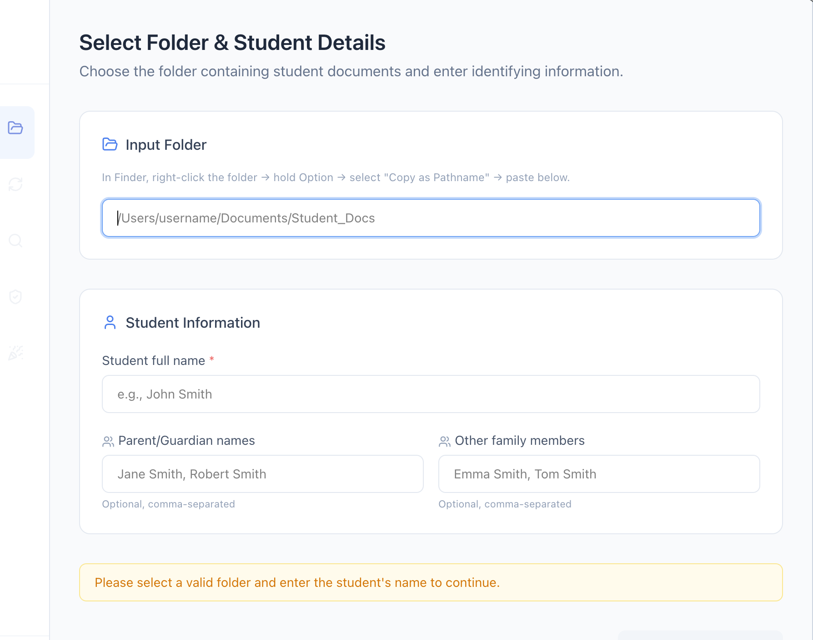
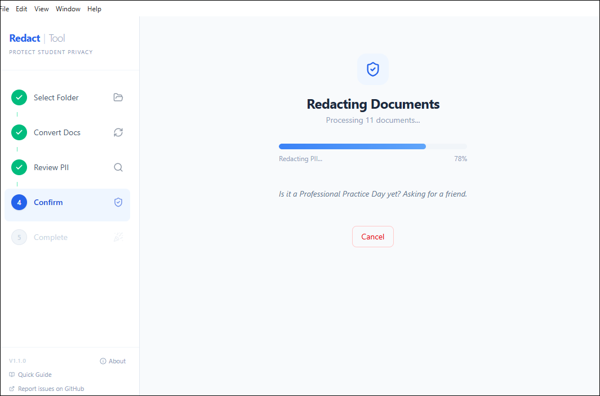
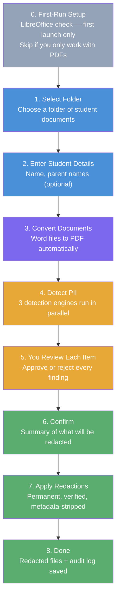
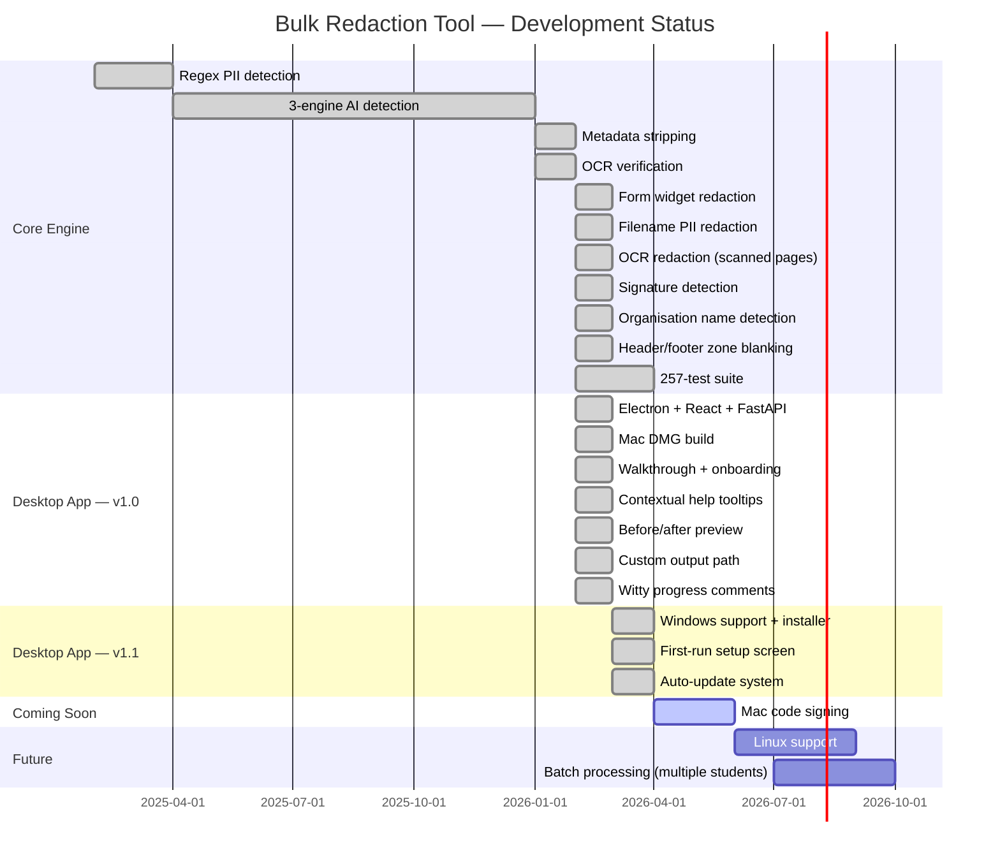

# Bulk Redaction Tool

**A free, private tool for removing student personal information from assessment documents — before you share them with anyone.**

Built for Australian teachers, psychologists, and support staff who handle sensitive student records. Everything runs on your own computer — Mac or Windows. No accounts. No subscriptions. No data ever leaves your machine.

---

## Downloads

> **Download the latest version for your platform from [GitHub Releases](https://github.com/mrdavearms/student-doc-redactor/releases):**
>
> | Platform | File | Notes |
> |----------|------|-------|
> | **macOS** (Apple Silicon) | `.dmg` installer | Drag to Applications. Not code-signed yet — see [macOS Gatekeeper note](#macos-gatekeeper-note) below. |
> | **Windows** (64-bit) | `.exe` installer | Standard NSIS installer. Choose your install directory. |
>
> **LibreOffice** (free) is required to process Word documents. The app will prompt you to install it on first launch if it's missing. [Download LibreOffice](https://www.libreoffice.org/download/download-libreoffice/). If you only work with PDFs, LibreOffice is not needed.
>
> If you prefer to run from source, see [Installation Guide](#-installation-guide) or [Desktop App (Developer)](#desktop-app-developer) below.

---

## What Is This?

When sharing student assessment reports — with other schools, services, or agencies — Australian privacy law and professional ethics require that identifying information be removed. Doing this manually is slow, error-prone, and stressful.

**The Bulk Redaction Tool automates this process.** You point it at a folder of documents, tell it the student's name, and it:

1. Finds every piece of personally identifiable information (PII) in the documents
2. Shows you each item for approval — you stay in control
3. Burns the approved items out of the PDFs permanently (not just visually covered — the text is gone)
4. Saves redacted copies alongside the originals, which are never touched
5. Produces a full audit log of everything that was redacted

> **Plain English:** It's like using a black marker on paper, except it works on PDFs and Word documents, it finds things you might miss, and it can't be undone by selecting the text.

### Two Ways to Run

| | Desktop App | Streamlit (browser) |
|--|-------------|-------------------|
| **What** | Native app for Mac and Windows (Electron) | Opens in your web browser |
| **Best for** | Everyday use | Developers / advanced users |
| **Run** | Double-click the installed app, or `cd desktop && npm run dev:electron` | `source venv/bin/activate && streamlit run app.py` |
| **Status** | Primary — actively developed | Legacy — still works, not the focus |

Both use the same detection and redaction engines underneath.

---

## Screenshots

<table>
  <tr>
    <td align="center">
      <br>
      <sub><b>Step 1 — Select Folder &amp; Student Details</b></sub>
    </td>
    <td align="center">
      <br>
      <sub><b>Step 2 — Document Conversion</b></sub>
    </td>
  </tr>
  <tr>
    <td align="center">
      <br>
      <sub><b>Step 4 — Final Confirmation</b></sub>
    </td>
    <td align="center">
      <br>
      <sub><b>Redaction in Progress</b></sub>
    </td>
  </tr>
</table>

---

## Privacy & Safety Guarantees

This matters most for a tool handling children's data.

| Guarantee | Detail |
|-----------|--------|
| Original files never modified | Redacted copies are saved separately. Your source documents are untouched. |
| Text is permanently destroyed | Redacted text cannot be recovered via copy/paste, search, or any PDF tool. It is not hidden — it is gone. |
| Metadata is stripped | Author names, dates, and hidden document properties (XMP data) are removed from output PDFs. |
| 100% local processing | No internet connection required. Your documents never leave your computer. |
| No accounts or cloud services | Nothing is uploaded anywhere. Ever. |
| Scanned pages handled | Image-only pages (scans) are redacted via OCR + image rewriting. No page is left behind. |
| Redaction verified | After redaction, the tool re-scans the output at 300 DPI to confirm the text is visually gone. |
| Form fields cleaned | Interactive PDF form fields (AcroForm widgets) containing PII are deleted — not just hidden. |
| Signatures detected | Handwritten signature images are automatically identified and blacked out using heuristic analysis. |
| Full audit trail | A `redaction_log.txt` records every item redacted, with page numbers and confidence levels. |

---

## How It Works

### The Workflow



### How PII Is Detected

The tool uses **three detection engines simultaneously**, then merges and deduplicates the results. This multi-engine approach catches far more than any single method:


**Why three engines?**
- **Regex** is fast and precise for structured data (phone numbers, Medicare numbers)
- **Presidio + spaCy** uses machine learning to recognise names and locations even when they appear in unexpected formats
- **GLiNER** is a zero-shot model — it can identify names it has never seen before, catching informal mentions that structured patterns miss

---

## What Gets Detected

All detection is tuned for **Australian** documents and naming conventions.

| Category | Examples | Engine |
|----------|----------|--------|
| Student name (all variations) | Full name, first name, last name, initials | Regex + Presidio + GLiNER |
| Parent / guardian names | Names provided by you, or found near keywords like "Mother:", "Father:" | Regex + GLiNER |
| Family member names | Siblings, carers, emergency contacts | Regex + GLiNER |
| Organisation names | Schools, clinics, hospitals — user-provided, word-level matching | Regex |
| Phone numbers | Mobile (04xx), landline, +61 format | Regex + Presidio |
| Email addresses | Any format | Regex |
| Home address | Street, suburb, state, postcode | Regex + Presidio |
| Date of birth | Only when labelled (DOB:, Date of Birth:, etc.) | Regex |
| Medicare number | 10-digit format, only when "Medicare" appears nearby | Regex + Presidio |
| Centrelink CRN | 9-character reference, only when labelled | Regex |
| Student ID | 3-letter prefix + 3 or more digits | Regex |
| Person names (unlabelled) | AI-detected names in free text | Presidio + GLiNER |
| Location mentions | Suburb and location references | Presidio |

### Name Detection — In Depth

The tool doesn't just search for the exact name you typed. It automatically generates **variations** of the student name and checks for all of them:

| Input | Variations Generated |
|-------|---------------------|
| `Joe Bloggs` | "Joe Bloggs", "Joe", "Bloggs", "J Bloggs", "J. Bloggs", "JF", "J.F." |

It also handles:

- **Possessive forms**: "Joe's" and "Joe's" (curly apostrophes) are matched as "Joe"
- **Contextual family detection**: If a line contains "(mother)" or "(father)", nearby names are flagged even without explicit labels
- **Parenthetical name patterns**: "Joe (parent: Sarah Bloggs)" catches both the student and parent name
- **Short names preserved**: Even 2-character names like "Jo" are matched if they exactly match the student name you entered

### Filename Redaction

If the student's name appears in the **filename** of a document (e.g. `Joe_Bloggs_Assessment.pdf`), the output file's name will have the PII replaced with `[REDACTED]`:

```
Input:  Joe_Bloggs_Assessment.pdf
Output: [REDACTED]_[REDACTED]_Assessment_redacted.pdf
```

This prevents accidental disclosure through file names in shared folders or email attachments.

---

## How Redaction Works

The tool uses **three different redaction strategies** depending on the type of content in each PDF page. This happens automatically — you don't need to choose.

### Strategy 1 — Text Layer Redaction (standard PDFs)

Most PDFs have a searchable text layer. For these pages:

1. The tool searches the text layer for each approved PII item
2. It draws a redaction annotation over the matching text
3. It applies the redaction — **permanently destroying the underlying text**
4. The redacted area becomes a solid black rectangle

This uses PyMuPDF's `apply_redactions()` with `images=PDF_REDACT_IMAGE_NONE` — meaning images on text-layer pages are never touched, only the text.

### Strategy 2 — OCR Image Redaction (scanned pages)

Scanned documents (where each page is a photograph or scan) have **no text layer** — the words exist only as pixels in an image. For these pages:

1. The page is rendered at **300 DPI** to a high-resolution image
2. **Tesseract OCR** reads every word and its position on the page
3. Each OCR word is compared against the approved PII list using intelligent matching:
   - Punctuation-stripped comparison (handles "Joe," matching "Joe")
   - Possessive handling ("Joe's" matches "Joe")
   - Special character preservation for emails/URLs ("joe@email.com" matched as-is)
4. Matching words are blacked out by drawing filled rectangles on the image
5. The original page content is replaced with the redacted image

> **Plain English:** The tool photographs the scanned page, reads the text in the photo using OCR, blacks out the PII words on the photo, then replaces the original page with the blacked-out version.

### Strategy 3 — Form Widget Deletion (interactive PDFs)

Some PDFs contain interactive form fields (text boxes, dropdowns) — called AcroForm widgets. These can contain PII that is invisible to text-layer search. After text-layer and OCR redaction, the tool scans every form widget, reads its field value, and deletes any widget containing PII.

### Strategy 4 — Signature Detection (heuristic image analysis)

Handwritten signatures embedded as images in PDFs are automatically detected and blacked out. The tool examines every embedded image on every page using four heuristic gates:

1. **Aspect ratio** — signatures are wide and short (width / height > 2.0)
2. **Position** — signatures don't span the full page width (< 250 points)
3. **Pixel size** — large enough to be a real signature (> 50 px wide, < 200 px tall)
4. **Ink ratio** — thin pen strokes on white background (< 30% dark pixels)

This runs on **every page**, not just pages with other detected PII.

### Which Strategy Is Used When?

The tool checks **each page independently**:

| Page Type | Detection Method | Redaction Method |
|-----------|-----------------|------------------|
| Has text layer | `page.get_text("words")` returns words | Text-layer redaction (Strategy 1) |
| Image-only (scan) | No text, but images present | OCR image redaction (Strategy 2) |
| Has form widgets | `page.widgets()` returns annotations | Widget deletion (Strategy 3, runs after 1 or 2) |
| Has embedded images | `page.get_images()` returns image refs | Signature detection (Strategy 4, runs on all pages) |

A single PDF can have mixed pages — some with text, some scanned. Each page gets the right strategy automatically.

### What Is NOT Redacted

- Professional names (psychologists, teachers, doctors — unless they match the student name)
- Assessment dates (unless explicitly labelled as a date of birth)
- Technical language, scores, and diagnostic terms
- Non-signature images (logos, charts, photos that don't match the signature heuristic)

### Confidence Scores

Every detected item is scored from **0.0** (uncertain) to **1.0** (certain). You see this score when reviewing — it helps you decide whether to approve or skip borderline items. You always have the final say.

---

## Desktop App Features

The desktop app includes UX features designed for non-technical users:

- **First-run setup screen** — automatically checks for LibreOffice on launch. If missing, a guided install prompt appears with a direct download link and a "Check Again" button. Auto-advances when LibreOffice is detected. Skip it if you only work with PDFs.
- **Auto-update notifications** — the app silently checks for updates in the background. When a new version is ready, a banner appears with download progress and a one-click "Restart Now" to install.
- **First-run walkthrough** — 4-step guided introduction that appears on first launch. Dismissible, with a "Quick Guide" button in the sidebar to re-open it any time.
- **Contextual help tooltips** — `?` icons next to every input field explaining what it does and why, in plain English.
- **Before/after preview** — Split-view comparison of original vs redacted pages on the completion screen. Images are fetched on-demand and never persisted to disk.
- **Per-document summary cards** — Expandable cards showing category breakdown and confidence indicators for each document. Never displays actual PII text.
- **Witty progress comments** — During the redaction step (which can take a minute for large batches), rotating teacher-themed comments keep you entertained. Shuffled randomly each time.
- **Custom output location** — Save redacted files to the default subfolder or browse to any location on your computer.
- **About modal** — Three tabs (About, How to Use, Features & Detection) accessible from the sidebar. Includes the full walkthrough content plus detection engine explanations.

---

## System Requirements

### Desktop App (recommended)

| Requirement | macOS | Windows |
|-------------|-------|---------|
| **OS** | macOS 12+ (Apple Silicon or Intel) | Windows 10/11 (64-bit) |
| **LibreOffice** | Needed for Word docs — [download](https://www.libreoffice.org/download/download-libreoffice/) | Needed for Word docs — [download](https://www.libreoffice.org/download/download-libreoffice/) |
| **Tesseract OCR** | Bundled in the app | Bundled in the app |
| **Disk space** | ~2 GB | ~2 GB |
| **RAM** | 8 GB recommended | 8 GB recommended |
| **Internet** | Only during installation | Only during installation |

The desktop app bundles Python, Tesseract, and all AI models. You only need to install LibreOffice separately if you want to process Word documents (.doc/.docx). If you only work with PDFs, nothing else is needed.

### Running from source (developers)

| Requirement | Details |
|-------------|---------|
| **Python** | Version 3.13 or later |
| **LibreOffice** | Required for Word to PDF conversion |
| **Tesseract OCR** | Required for scanned/image-only PDFs |
| **Disk space** | ~2 GB (for AI models: spaCy + GLiNER) |

> **Linux** is not currently supported but is on the roadmap.

### macOS Gatekeeper Note

The Mac app is not code-signed yet. When you first open it, macOS may block it with "App can't be opened because it is from an unidentified developer." To bypass this:

1. Right-click (or Control-click) the app in Finder
2. Select **Open** from the context menu
3. Click **Open** in the dialog that appears

You only need to do this once — macOS remembers your choice. Code signing is planned for a future release.

---

## Installation Guide

> **Note:** This guide is for running from source on macOS. Most users should download the desktop app from [GitHub Releases](https://github.com/mrdavearms/student-doc-redactor/releases) instead — no installation steps required.
>
> This guide assumes no prior experience with Terminal or coding. Take it one step at a time. If anything goes wrong, see [Troubleshooting](#troubleshooting).

### Step 1 — Open Terminal

Terminal is a built-in Mac app that lets you type instructions to your computer.

1. Press **Command + Space** to open Spotlight Search
2. Type `Terminal` and press **Enter**
3. A window with a text prompt will appear — this is normal

---

### Step 2 — Install Homebrew (Mac package manager)

Homebrew is a free tool that makes installing other software easy. If you've already done this before, skip to Step 3.

Paste this into Terminal and press **Enter**:

```bash
/bin/bash -c "$(curl -fsSL https://raw.githubusercontent.com/Homebrew/install/HEAD/install.sh)"
```

Follow the on-screen instructions. It may ask for your Mac password (you won't see it as you type — that's normal).

---

### Step 3 — Install LibreOffice

LibreOffice converts Word documents to PDF for processing.

```bash
brew install --cask libreoffice
```

---

### Step 4 — Install Tesseract OCR

Tesseract reads text from scanned documents and images.

```bash
brew install tesseract
```

---

### Step 5 — Install Python 3.13

```bash
brew install python@3.13
```

---

### Step 6 — Download the Redaction Tool

If you have `git` installed:

```bash
git clone https://github.com/mrdavearms/student-doc-redactor.git
cd student-doc-redactor
```

Or download the ZIP file from GitHub:
1. Go to [github.com/mrdavearms/student-doc-redactor](https://github.com/mrdavearms/student-doc-redactor)
2. Click the green **Code** button, then **Download ZIP**
3. Unzip the downloaded file
4. In Terminal, navigate to the folder: `cd ~/Downloads/student-doc-redactor`

---

### Step 7 — Set Up the Python Environment

This creates a private workspace for the tool's Python code (so it doesn't interfere with anything else on your Mac):

```bash
python3.13 -m venv venv
source venv/bin/activate
pip install -r requirements.txt
```

This step downloads the AI models and may take **5-10 minutes**. You'll see a progress bar. That's normal.

---

### Step 8 — Download the spaCy Language Model

```bash
python -m spacy download en_core_web_lg
```

---

### Installation Complete

You're ready to run the tool. You won't need to repeat these steps — just start from [Running the App](#running-the-app) next time.

---

## Running the App

### Streamlit version (browser-based)

1. Open Terminal
2. Navigate to the tool's folder:
   ```bash
   cd ~/student-doc-redactor
   ```
3. Run the app:
   ```bash
   ./run.sh
   ```
4. Your browser will open automatically to `http://localhost:8501`

To stop: press **Control + C** in Terminal.

### Desktop App (Developer)

To run the desktop app in development mode:

```bash
cd desktop && npm install && npm run dev:electron
```

This starts Vite (hot reload), auto-spawns the FastAPI backend, and opens the Electron window.

To build installers locally:

```bash
# Mac DMG (run on macOS)
cd desktop && npm run dist:mac

# Windows installer (run on Windows)
cd desktop && npm run dist:win
```

The output appears in `desktop/release/`.

---

## Using the App — Screen by Screen

### Screen 0 — First-Run Setup (first launch only)

If LibreOffice is not installed when the app first opens, you land here instead of the main workflow. The screen prompts you to download and install LibreOffice, then click **Check Again** — the app re-checks automatically and advances when LibreOffice is found.

Click **Skip for now — I only have PDFs** to bypass this screen entirely if you don't need Word document support.

This screen only appears once. On subsequent launches with LibreOffice present, the app goes straight to Screen 1.

---

### Screen 1 — Select Folder & Enter Student Details

- **Folder path**: Paste or type the full path to a folder containing the student's documents (PDFs and/or Word files), or click **Browse** to select it.
- **Student name**: First and last name. The tool automatically generates variations (first name only, last name only, initials, etc.)
- **Parent/Guardian names**: Optional. Helps catch parent names that appear in documents.
- **Other family names**: Optional. Siblings, carers, emergency contacts.
- **Organisation names**: Optional. Schools, clinics, hospitals — any org that could identify the student.
- **Redact headers & footers**: Optional. Blanks the top and bottom of every page to remove letterheads and addresses.

Each field has a `?` tooltip explaining what it does and why it matters.

> **Tip:** To find a folder's path on Mac, right-click the folder in Finder, hold **Option**, and select **Copy "folder" as Pathname**.

---

### Screen 2 — Document Conversion

The tool shows which documents were found and whether Word files were successfully converted to PDF. PII detection runs automatically after conversion completes.

---

### Screen 3 — Review Detected PII

This is the most important screen. **You review every item the tool found** — nothing is redacted without your approval.

- **Tick the checkbox** next to items you want redacted — everything is ticked by default
- **Leave items unticked** only if you are certain they should stay (e.g. a score label misread as a name)
- **Confidence badges**: High (green), Medium (amber), Low (rose) — helps you decide on borderline items
- **Accept All & Continue**: Accepts all ticked items and moves to the summary — recommended for most users
- Documents with no PII are automatically skipped

---

### Screen 4 — Final Confirmation

A summary of how many items across how many documents will be redacted, broken down by category.

**Output folder options:**
- **Inside the source folder** (default) — a `redacted` subfolder is created alongside your originals
- **Choose a different location** — browse to save redacted files anywhere on your computer

---

### Screen 5 — Complete

- **Green banner**: Redaction succeeded and was verified
- **Orange banner**: Some pages were image-only (scanned) and were redacted via OCR — review recommended
- **Red banner**: A verification check failed — review that document carefully
- **Before/after preview**: Side-by-side comparison of original and redacted pages
- **Document summary cards**: Per-document breakdown of what was redacted, by category
- **Open Folder** button to jump straight to the output
- **Redaction Log**: Expandable audit trail of every item redacted

---

## Output Files

After processing, redacted files are saved to your chosen location (default: a `redacted` subfolder):

```
your-folder/
├── original-document.pdf          <-- never modified
├── original-document.docx         <-- never modified
├── redacted/
│   ├── original-document_redacted.pdf    <-- redacted copy
│   └── another-doc_redacted.pdf
└── redaction_log.txt              <-- full audit trail
```

### The Audit Log

`redaction_log.txt` records every redaction:

```
Document: Assessment_Report.pdf
  Page 2, Line 4  | "Joe Bloggs"     | Student name  | confidence: 1.00
  Page 2, Line 7  | "04 1234 5678"  | Phone number  | confidence: 0.98
  Page 3, Line 1  | "joe@mail.com" | Email address | confidence: 0.97

NOTE: Scanned_Report.pdf
  Pages 1-3 used OCR redaction (image-only pages) — review recommended
```

Keep this log. It is your record of what was removed and when.

---

## Troubleshooting

### "LibreOffice not found"

```bash
brew install --cask libreoffice
```

### "Tesseract not found"

```bash
brew install tesseract
```

### "No module named presidio_analyzer" or similar

Your virtual environment may not be active. Run:

```bash
source venv/bin/activate
pip install -r requirements.txt
```

### "Port already in use"

Streamlit will automatically try the next available port (8502, 8503, etc.). Check the Terminal output for the correct URL. For the desktop app, the backend runs on port 8765 — if that's in use, check for another instance running.

### Browser doesn't open (Streamlit)

Manually navigate to: **http://localhost:8501**

### Word documents not converting

Make sure LibreOffice is installed (Step 3 above). On Intel Macs, the tool also checks `/usr/local/bin/soffice` (Homebrew) and the app bundle automatically.

### Scanned documents not being read

Make sure Tesseract is installed (Step 4 above). Documents that are scans of printed pages (image-only PDFs) are read via OCR — the quality of detection depends on the scan quality.

### A redaction didn't work on a scanned page

Scanned pages are redacted using OCR (optical character recognition). The quality depends on scan quality — blurry or low-resolution scans may cause Tesseract to misread words. If you see PII surviving redaction:

1. Check the scan quality — re-scan at 300 DPI or higher if possible
2. The audit log will note which pages used OCR redaction
3. For very poor scans, manual redaction may still be needed

---

## Roadmap



---

## For Developers

### Repository

```
GitHub: https://github.com/mrdavearms/student-doc-redactor (primary)
GitLab: https://gitlab.com/davearmswork/bulk-redaction-tool (mirror)
```

Branches: `main` (stable) · `test` (development)

### File Structure

```
student-doc-redactor/
├── app.py                          # Streamlit entry point (legacy)
├── run.sh                          # Streamlit launch script
├── requirements.txt                # Python dependencies
├── CLAUDE.md                       # AI development context
│
├── src/
│   ├── core/
│   │   ├── pii_orchestrator.py     # 3-engine orchestrator (main detection entry point)
│   │   ├── pii_detector.py         # Regex detection engine + PIIMatch dataclass
│   │   ├── presidio_recognizers.py # 6 custom Australian Presidio recognizers
│   │   ├── gliner_provider.py      # GLiNER zero-shot NER wrapper
│   │   ├── redactor.py             # Multi-path redaction + metadata strip + signature detection
│   │   ├── text_extractor.py       # Text + OCR extraction from PDFs
│   │   ├── document_converter.py   # LibreOffice Word to PDF conversion
│   │   ├── binary_resolver.py      # Cross-platform binary path resolution
│   │   ├── logger.py               # Audit log generation and save
│   │   └── session_state.py        # Streamlit session management
│   ├── services/
│   │   ├── conversion_service.py   # Document conversion business logic
│   │   ├── detection_service.py    # PII detection business logic
│   │   └── redaction_service.py    # Redaction orchestration + custom output paths
│   └── ui/
│       └── screens.py              # All 5 Streamlit screens
│
├── backend/
│   ├── main.py                     # FastAPI API layer + detection cache
│   └── schemas.py                  # Pydantic request/response models
│
├── desktop/
│   ├── electron/
│   │   ├── main.cjs                # Electron main process (spawns backend)
│   │   └── preload.cjs             # Electron preload (IPC bridge)
│   ├── src/
│   │   ├── App.tsx                 # React entry point, screen router
│   │   ├── main.tsx                # Vite entry point
│   │   ├── store.ts                # Zustand single store
│   │   ├── api.ts                  # HTTP client for backend
│   │   ├── types.ts                # TypeScript type definitions
│   │   ├── index.css               # Tailwind v4 theme + utility classes
│   │   ├── electron.d.ts           # Electron IPC type declarations
│   │   ├── hooks/
│   │   │   └── useUpdater.ts           # Auto-update state machine
│   │   ├── pages/
│   │   │   ├── FolderSelection.tsx     # Step 1: folder + student details
│   │   │   ├── ConversionStatus.tsx    # Step 2: Word to PDF conversion
│   │   │   ├── DocumentReview.tsx      # Step 3: review detected PII
│   │   │   ├── FinalConfirmation.tsx   # Step 4: confirm + output options
│   │   │   ├── Completion.tsx          # Step 5: results + preview
│   │   │   └── Setup.tsx                # First-run: LibreOffice check
│   │   └── components/
│   │       ├── Layout.tsx              # Main layout, animated transitions
│   │       ├── Sidebar.tsx             # Step indicator, logo, walkthrough
│   │       ├── Walkthrough.tsx         # 4-step first-run onboarding
│   │       ├── HelpTip.tsx             # Contextual ? tooltip popover
│   │       ├── AboutModal.tsx          # 3-tab About dialog
│   │       ├── PreviewSection.tsx      # Before/after PDF preview
│   │       ├── DocumentCard.tsx        # Per-document summary card
│   │       ├── RedactionProgress.tsx   # Progress bar + witty comments
│   │       └── UpdateBanner.tsx         # Auto-update notification bar
│   ├── package.json
│   └── vite.config.ts
│
├── docs/
│   ├── plans/                      # Implementation plans (reference only)
│   └── legacy/                     # Outdated docs moved from root
│
└── tests/
    ├── test_pii_detector.py         # 39 tests
    ├── test_pii_detector_names.py   # 54 tests
    ├── test_pii_orchestrator.py     # 22 tests
    ├── test_presidio_recognizers.py # 18 tests
    ├── test_gliner_provider.py      # 12 tests
    ├── test_redactor.py             # 11 tests
    ├── test_signature_detection.py  # 16 tests
    ├── test_ocr_redaction.py        # 19 tests
    ├── test_ocr_verification.py     # 7 tests
    ├── test_metadata_stripping.py   # 8 tests
    ├── test_widget_redaction.py     # 6 tests
    ├── test_filename_redaction.py   # 13 tests
    ├── test_zone_redaction.py       # 5 tests
    ├── test_session_state.py        # 2 tests
    └── test_binary_resolver.py      # 6 tests
```

### Running Tests

```bash
source venv/bin/activate
pytest tests/ -v
```

All 257 tests should pass in under 5 minutes.

### Tech Stack

| Component | Technology |
|-----------|-----------|
| Desktop UI | Electron + React + Vite + Tailwind v4 + Framer Motion |
| Desktop state | Zustand |
| API layer | FastAPI + Pydantic |
| Legacy UI | Streamlit |
| PDF processing | PyMuPDF (fitz) |
| Image redaction | Pillow (PIL) ImageDraw |
| AI / NER | Microsoft Presidio + spaCy `en_core_web_lg` |
| Zero-shot NER | GLiNER |
| OCR | Tesseract + pytesseract |
| Word conversion | LibreOffice headless |
| Tests | pytest (257 tests) |
| Language | Python 3.13+ / TypeScript |

---

## Contributing

This tool is actively developed. Bug reports and suggestions are welcome — please open an issue on GitHub.

If you are a teacher, school psychologist, or support staff and would like to share feedback about what the tool does or doesn't catch in real documents (without sharing the documents themselves), please open an issue with the label `feedback`.

---

## Licence

This project is currently unlicensed (private development). A licence will be added when the public release is made. Until then, please do not redistribute.

---

*Built for Australian educators handling sensitive student data.*
*All processing is local. Your students' information stays on your computer.*
