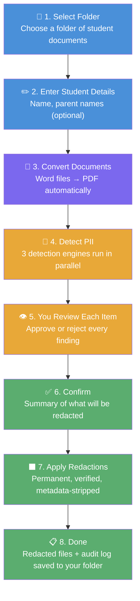
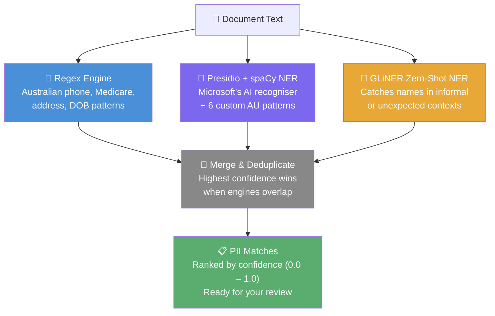
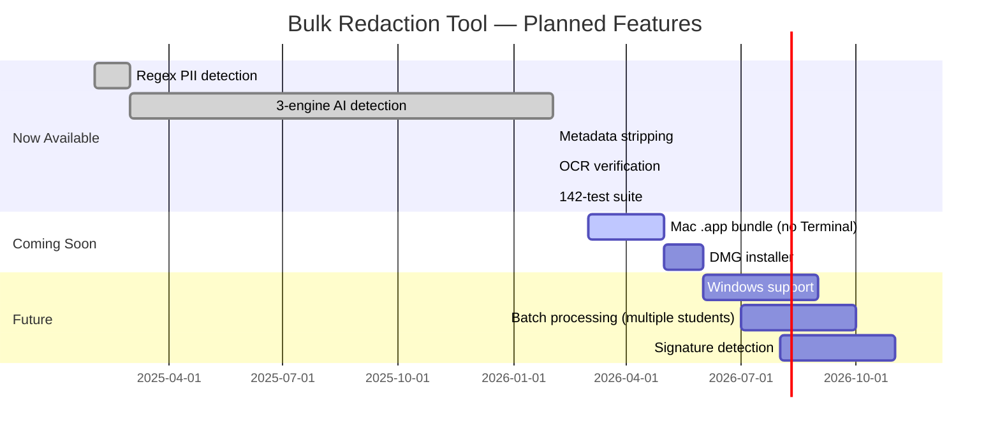

# 🖊️ Bulk Redaction Tool

**A free, private, Mac-based tool for removing student personal information from assessment documents — before you share them with anyone.**

Built for Australian teachers, psychologists, and support staff who handle sensitive student records. Everything runs on your own Mac. No accounts. No subscriptions. No data ever leaves your computer.

---

## 📥 Downloads

> **Coming soon.** A one-click Mac installer (`.dmg`) is in development — no Terminal, no setup required.
>
> In the meantime, follow the [Installation Guide](#-installation-guide) below to get started.
>
> **Star or watch this repository** on GitLab to be notified when the download is available:
> 👉 [gitlab.com/davearmswork/bulk-redaction-tool](https://gitlab.com/davearmswork/bulk-redaction-tool)

---

## 🧭 What Is This?

When sharing student assessment reports — with other schools, services, or agencies — Australian privacy law and professional ethics require that identifying information be removed. Doing this manually is slow, error-prone, and stressful.

**The Bulk Redaction Tool automates this process.** You point it at a folder of documents, tell it the student's name, and it:

1. Finds every piece of personally identifiable information (PII) in the documents
2. Shows you each item for approval — you stay in control
3. Burns the approved items out of the PDFs permanently (not just visually covered — the text is gone)
4. Saves redacted copies alongside the originals, which are never touched
5. Produces a full audit log of everything that was redacted

> **Plain English:** It's like using a black marker on paper, except it works on PDFs and Word documents, it finds things you might miss, and it can't be undone by selecting the text.

---

## 🔒 Privacy & Safety Guarantees

This matters most for a tool handling children's data.

| Guarantee | Detail |
|-----------|--------|
| ✅ **Original files never modified** | Redacted copies are saved separately. Your source documents are untouched. |
| ✅ **Text is permanently destroyed** | Redacted text cannot be recovered via copy/paste, search, or any PDF tool. It is not hidden — it is gone. |
| ✅ **Metadata is stripped** | Author names, dates, and hidden document properties (XMP data) are removed from output PDFs. |
| ✅ **100% local processing** | No internet connection required. Your documents never leave your Mac. |
| ✅ **No accounts or cloud services** | Nothing is uploaded anywhere. Ever. |
| ✅ **Redaction verified** | After redaction, the tool re-scans the output at 300 DPI to confirm the text is visually gone. |
| ✅ **Full audit trail** | A `redaction_log.txt` records every item redacted, with page numbers and confidence levels. |

---

## 🔍 How It Works

### The Workflow



### How PII Is Detected

The tool uses **three detection engines simultaneously**, then merges and deduplicates the results. This multi-engine approach catches far more than any single method:



**Why three engines?**
- **Regex** is fast and precise for structured data (phone numbers, Medicare numbers)
- **Presidio + spaCy** uses machine learning to recognise names and locations even when they appear in unexpected formats
- **GLiNER** is a zero-shot model — it can identify names it has never seen before, catching informal mentions that structured patterns miss

---

## 🛡️ What Gets Detected

All detection is tuned for **Australian** documents and naming conventions.

| Category | Examples | Engine |
|----------|----------|--------|
| Student name (all variations) | Full name, first name, last name, initials | Regex + Presidio + GLiNER |
| Parent / guardian names | Names provided by you, or found near keywords like "Mother:", "Father:" | Regex + GLiNER |
| Family member names | Siblings, carers, emergency contacts | Regex + GLiNER |
| Phone numbers | Mobile (04xx), landline, +61 format | Regex + Presidio |
| Email addresses | Any format | Regex |
| Home address | Street, suburb, state, postcode | Regex + Presidio |
| Date of birth | Only when labelled (DOB:, Date of Birth:, etc.) | Regex |
| Medicare number | 10-digit format, only when "Medicare" appears nearby | Regex + Presidio |
| Centrelink CRN | 9-character reference, only when labelled | Regex |
| Student ID | 3-letter prefix + 3 or more digits | Regex |
| Person names (unlabelled) | AI-detected names in free text | Presidio + GLiNER |
| Location mentions | Suburb and location references | Presidio |

### What Is NOT Redacted

- Professional names (psychologists, teachers, doctors — unless they match the student name)
- School names and organisations
- Assessment dates (unless explicitly labelled as a date of birth)
- Technical language, scores, and diagnostic terms

### Confidence Scores

Every detected item is scored from **0.0** (uncertain) to **1.0** (certain). You see this score when reviewing — it helps you decide whether to approve or skip borderline items. You always have the final say.

---

## 💻 System Requirements

| Requirement | Details |
|-------------|---------|
| **Operating system** | macOS (Apple Silicon M1/M2/M3 or Intel) |
| **Python** | Version 3.13 or later |
| **LibreOffice** | Required for Word → PDF conversion |
| **Tesseract OCR** | Required for scanned/image-only PDFs |
| **Disk space** | ~2 GB (for AI models: spaCy + GLiNER) |
| **RAM** | 8 GB recommended |
| **Internet** | Only needed during installation |

> **Windows and Linux** are not currently supported. They are on the roadmap.

---

## 🚀 Installation Guide

> 💡 **This guide assumes no prior experience** with Terminal or coding. Take it one step at a time. If anything goes wrong, see [Troubleshooting](#-troubleshooting).

### Step 1 — Open Terminal

Terminal is a built-in Mac app that lets you type instructions to your computer.

1. Press **⌘ Command + Space** to open Spotlight Search
2. Type `Terminal` and press **Enter**
3. A window with a text prompt will appear — this is normal

---

### Step 2 — Install Homebrew (Mac package manager)

Homebrew is a free tool that makes installing other software easy. If you've already done this before, skip to Step 3.

Paste this into Terminal and press **Enter**:

```bash
/bin/bash -c "$(curl -fsSL https://raw.githubusercontent.com/Homebrew/install/HEAD/install.sh)"
```

Follow the on-screen instructions. It may ask for your Mac password (you won't see it as you type — that's normal).

---

### Step 3 — Install LibreOffice

LibreOffice converts Word documents to PDF for processing.

```bash
brew install --cask libreoffice
```

---

### Step 4 — Install Tesseract OCR

Tesseract reads text from scanned documents and images.

```bash
brew install tesseract
```

---

### Step 5 — Install Python 3.13

```bash
brew install python@3.13
```

---

### Step 6 — Download the Redaction Tool

If you have `git` installed:

```bash
git clone https://gitlab.com/davearmswork/bulk-redaction-tool.git
cd bulk-redaction-tool
```

Or download the ZIP file from GitLab:
1. Go to [gitlab.com/davearmswork/bulk-redaction-tool](https://gitlab.com/davearmswork/bulk-redaction-tool)
2. Click the blue **Code** button → **Download source code** → **zip**
3. Unzip the downloaded file
4. In Terminal, navigate to the folder: `cd ~/Downloads/bulk-redaction-tool`

---

### Step 7 — Set Up the Python Environment

This creates a private workspace for the tool's Python code (so it doesn't interfere with anything else on your Mac):

```bash
python3.13 -m venv venv
source venv/bin/activate
pip install -r requirements.txt
```

This step downloads the AI models and may take **5–10 minutes**. You'll see a progress bar. That's normal.

---

### Step 8 — Download the spaCy Language Model

```bash
python -m spacy download en_core_web_lg
```

---

### ✅ Installation Complete

You're ready to run the tool. You won't need to repeat these steps — just start from [Running the App](#-running-the-app) next time.

---

## 🎬 Running the App

### Every time you want to use the tool:

1. Open Terminal
2. Navigate to the tool's folder (replace the path with wherever you saved it):

```bash
cd ~/bulk-redaction-tool
```

3. Run the app:

```bash
./run.sh
```

4. Your browser will open automatically to `http://localhost:8501`

If the browser doesn't open, manually visit: **http://localhost:8501**

### To stop the app:

Press **Control + C** in Terminal.

---

## 📖 Using the App — Screen by Screen

### Screen 1 — Select Folder & Enter Student Details

```
┌─────────────────────────────────────────────────┐
│  📂 Folder path: [/path/to/student/documents   ]│
│                                                  │
│  👤 Student name: [                            ] │
│  👨‍👩‍👧 Parent name (optional): [                 ] │
│  👪 Other family names (optional): [           ] │
│                                                  │
│              [ Start Processing → ]              │
└─────────────────────────────────────────────────┘
```

- **Folder path**: Paste or type the full path to a folder containing the student's documents (PDFs and/or Word files). The folder can contain multiple documents.
- **Student name**: First and last name. The tool automatically generates variations (first name only, last name only, initials, etc.)
- **Parent/Guardian name**: Optional. Helps catch parent names that appear in documents.
- **Other family names**: Optional. Siblings, carers, emergency contacts.

> 💡 **Tip:** To find a folder's path on Mac, right-click the folder in Finder, hold **Option**, and select **Copy "folder" as Pathname**.

---

### Screen 2 — Document Conversion

The tool shows which documents were found and whether Word files were successfully converted to PDF. Green = ready. Orange = needs attention (the original Word file is still processed where possible).

---

### Screen 3 — Review Detected PII

This is the most important screen. **You review every item the tool found** — nothing is redacted without your approval.

```
┌─────────────────────────────────────────────────┐
│  Document: Assessment_Report.pdf     Page 2     │
│  ─────────────────────────────────────────────  │
│  ✅  "Joe Bloggs"        Student name    1.00    │
│  ✅  "04 1234 5678"     Phone number    0.98    │
│  ✅  "joe@email.com"   Email address   0.97    │
│  ⬜  "John"             Person (NER)    0.62    │
│  ⬜  "Melbourne"        Location (NER)  0.55    │
│  ─────────────────────────────────────────────  │
│  [ ← Previous ]              [ Next → Continue ]│
└─────────────────────────────────────────────────┘
```

- **Tick the checkbox** next to items you want redacted
- **Leave items unticked** if they should stay (e.g. a teacher's name, a school name)
- **Confidence score** (0.0 – 1.0): Higher = more certain. Items below 0.7 are worth double-checking.

---

### Screen 4 — Confirm

A summary of how many items across how many documents will be redacted. Review it, then click **Create Redacted Documents**.

---

### Screen 5 — Complete

- **Green banner**: Redaction succeeded and was verified
- **Orange banner**: Some items were on image-only (scanned) pages — manual review recommended for those pages
- **Red banner**: A verification check failed — review that document carefully

Links to open the output folder and view the audit log are on this screen.

---

## 📁 Output Files

After processing, two items are added to your original folder:

```
your-folder/
├── original-document.pdf          ← never modified
├── original-document.docx         ← never modified
├── redacted/
│   ├── original-document_redacted.pdf    ← redacted copy
│   └── another-doc_redacted.pdf
└── redaction_log.txt              ← full audit trail
```

### The Audit Log

`redaction_log.txt` records every redaction:

```
Document: Assessment_Report.pdf
  Page 2, Line 4  │ "Joe Bloggs"     │ Student name  │ confidence: 1.00
  Page 2, Line 7  │ "04 1234 5678"  │ Phone number  │ confidence: 0.98
  Page 3, Line 1  │ "joe@mail.com" │ Email address │ confidence: 0.97

⚠️  FLAGGED: Scanned_Report.pdf
  Contains 3 item(s) on image-only pages — manual review required
```

Keep this log. It is your record of what was removed and when.

---

## 🔧 Troubleshooting

### "LibreOffice not found"

```bash
brew install --cask libreoffice
```

### "Tesseract not found"

```bash
brew install tesseract
```

### "No module named presidio_analyzer" or similar

Your virtual environment may not be active. Run:

```bash
source venv/bin/activate
pip install -r requirements.txt
```

### "Port already in use"

Streamlit will automatically try the next available port (8502, 8503, etc.). Check the Terminal output for the correct URL.

### Browser doesn't open

Manually navigate to: **http://localhost:8501**

### Word documents not converting

Make sure LibreOffice is installed (Step 3 above). On Intel Macs, the tool also checks `/usr/local/bin/soffice` (Homebrew) and the app bundle automatically.

### Scanned documents not being read

Make sure Tesseract is installed (Step 4 above). Documents that are scans of printed pages (image-only PDFs) are read via OCR — the quality of detection depends on the scan quality.

### A redaction didn't work on a scanned page

Scanned pages (image-only PDFs) cannot be automatically redacted — the text has no underlying data layer to edit. The tool will flag these pages with a warning. For those pages, you will need to redact manually.

---

## 🗺️ Roadmap



---

## 🏗️ For Developers

### Repository

```
https://gitlab.com/davearmswork/bulk-redaction-tool
```

Branches: `main` (stable) · `test` (development)

### File Structure

```
bulk-redaction-tool/
├── app.py                          # Streamlit entry point
├── run.sh                          # Launch script
├── requirements.txt                # Python dependencies
├── venv/                           # Virtual environment (not in git)
│
├── src/
│   ├── core/
│   │   ├── pii_orchestrator.py     # 3-engine orchestrator (main entry point)
│   │   ├── pii_detector.py         # Regex detection engine
│   │   ├── presidio_recognizers.py # 6 custom AU Presidio recognizers
│   │   ├── gliner_provider.py      # GLiNER zero-shot NER wrapper
│   │   ├── redactor.py             # PyMuPDF redaction + metadata strip
│   │   ├── text_extractor.py       # Text + OCR extraction
│   │   ├── document_converter.py   # LibreOffice Word → PDF
│   │   ├── logger.py               # Audit log generation
│   │   └── session_state.py        # Streamlit session management
│   └── ui/
│       └── screens.py              # All 5 Streamlit screens
│
└── tests/
    ├── test_pii_detector.py         # 39 tests: patterns, integration
    ├── test_pii_detector_names.py   # 44 tests: name variations, contextual
    ├── test_pii_orchestrator.py     # Orchestrator merge/dedup tests
    ├── test_presidio_recognizers.py # AU recognizer unit tests
    ├── test_gliner_provider.py      # GLiNER wrapper tests
    ├── test_metadata_stripping.py   # PDF metadata removal tests
    └── test_ocr_verification.py    # Post-redaction OCR verification tests
```

### Running Tests

```bash
source venv/bin/activate
pytest tests/ -v
```

All 142 tests should pass in under 30 seconds.

### Tech Stack

| Component | Technology |
|-----------|-----------|
| UI | Streamlit |
| PDF processing | PyMuPDF (fitz) |
| AI / NER | Microsoft Presidio + spaCy `en_core_web_lg` |
| Zero-shot NER | GLiNER |
| OCR | Tesseract + pytesseract |
| Word conversion | LibreOffice headless |
| Tests | pytest |
| Language | Python 3.13+ |

---

## 🤝 Contributing

This tool is actively developed. Bug reports and suggestions are welcome — please open an issue on GitLab.

If you are a teacher, school psychologist, or support staff and would like to share feedback about what the tool does or doesn't catch in real documents (without sharing the documents themselves), please open an issue with the label `feedback`.

---

## 📄 Licence

This project is currently unlicensed (private development). A licence will be added when the public release is made. Until then, please do not redistribute.

---

*Built with ❤️ for Australian educators handling sensitive student data.*
*All processing is local. Your students' information stays on your Mac.*
